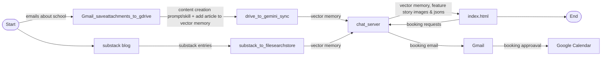

# substack_to_filesearchstore.py

Syncs all published posts from a Substack blog into a Google Gemini File Search Store. Designed to be run repeatedly — it detects previously uploaded posts and only uploads new ones.

## How it works

1. Fetches all posts from the Substack API (`/api/v1/posts`)
2. Checks which posts are already in the File Search Store (matched by display name)
3. Converts new posts from HTML to plain text
4. Uploads each new post as a separate `.txt` document
5. On the first run, creates a new File Search Store and saves the ID to `.env`

## Setup

### Dependencies

```
pip install requests beautifulsoup4 python-dotenv google-genai
```

### Environment variables (in `.env`)

| Variable | Description | Example |
|----------|-------------|---------|
| `GEMINI_API_KEY` | Google AI Studio API key | `AIzaSy...` |
| `SUBSTACK_URL` | Base URL of the Substack blog | `https://acgarcia21.substack.com` |
| `SUBSTACK_STORE_ID` | File Search Store ID (auto-created on first run) | `fileSearchStores/substackblog-abc123` |

## Usage

```
python substack_to_filesearchstore.py
```

### First run

Creates a new File Search Store, uploads all posts, and saves `SUBSTACK_STORE_ID` to `.env`:

```
Creating new File Search Store "SubstackBlog"...
Created store: fileSearchStores/substackblog-5jlx2i33k1ir
Saved SUBSTACK_STORE_ID to .env
Fetching posts from https://acgarcia21.substack.com...
Found 38 post(s)
  UPLOAD: Ship code, Deploy (4765 chars)
  UPLOAD: Tighten Up Your Brand (4849 chars)
  ...
```

### Subsequent runs

Skips already-uploaded posts, only uploads new ones:

```
Using existing store: fileSearchStores/substackblog-5jlx2i33k1ir
  39 document(s) already in store
Found 40 post(s)
  SKIP (already uploaded): Ship code, Deploy
  SKIP (already uploaded): Tighten Up Your Brand
  UPLOAD: My Newest Post (3200 chars)
```

## Querying the store

Once posts are uploaded, you can query them via the `/substack` endpoint on `chat_server.py`:

```
POST /substack
Content-Type: application/json

{"question": "What did Anthony write about agile?"}
```

---

# booking_manager.py

Handles meeting booking with a human-in-the-loop approval flow. Used as a library by `chat_server.py` — not run as a standalone service.

## How it works

1. A visitor requests a meeting through the `/substack` chat interface
2. Gemini extracts meeting details (name, email, date, time, duration, purpose) via function calling
3. `booking_manager` checks Google Calendar availability using the FreeBusy API
4. If the slot is free, it stores a pending booking in SQLite and emails Anthony an approval request with Approve/Decline buttons
5. Anthony clicks Approve or Decline from the email
6. On approval: a Google Calendar event is created (with the requester as an attendee) and a confirmation email is sent to the requester

## Dependencies

Requires the same packages as `chat_server.py`, plus:

```
pip install google-api-python-client google-auth google-auth-oauthlib
```

## Google APIs required

Enable these in the [Google Cloud Console](https://console.cloud.google.com/apis/library) for your project:

- **Google Calendar API** — availability checks and event creation
- **Gmail API** — sending approval and confirmation emails

## OAuth token

`booking_manager.py` uses `token.json` (generated by `get_token.py`) for OAuth credentials. The token must include the `gmail.send` and `calendar` scopes. To regenerate:

```
del token.json
python get_token.py
```

Then deploy `token.json` to the server.

## Environment variables (in `.env`)

| Variable | Description | Example |
|----------|-------------|---------|
| `TOKEN_FILE` | Path to OAuth token file | `/var/www/cognitivemetaphors/token.json` |
| `CREDENTIALS_FILE` | Path to OAuth client secrets | `/var/www/cognitivemetaphors/credentials.json` |
| `DB_PATH` | Path to SQLite database (auto-created) | `/var/www/cognitivemetaphors/bookings.db` |
| `SERVER_BASE_URL` | Base URL for approval/decline links in emails | `http://143.42.1.253:5000` |

## Database

SQLite database (`bookings.db`) is created automatically on the first booking request. Schema:

| Column | Type | Description |
|--------|------|-------------|
| `approval_token` | TEXT | Unique token used in approve/decline URLs |
| `status` | TEXT | `pending`, `approved`, or `declined` |
| `requester_name` | TEXT | Name of the person requesting the meeting |
| `requester_email` | TEXT | Email for confirmation and calendar invite |
| `meeting_date` | TEXT | Date in `YYYY-MM-DD` format |
| `meeting_time` | TEXT | Time in `HH:MM` 24-hour format (Eastern) |
| `duration_minutes` | INTEGER | Meeting length in minutes |
| `purpose` | TEXT | Topic or reason for the meeting |

## Endpoints (served by chat_server.py)

| Endpoint | Description |
|----------|-------------|
| `GET /approve-booking/<token>` | Anthony clicks this from the approval email |
| `GET /decline-booking/<token>` | Anthony clicks this to decline |
| `GET /booking-status/<token>` | Check booking status (pending/approved/declined) |

---

# file_search_store_cleanup.py

Deletes documents from a Gemini File Search Store. Supports deleting all documents or a specific subset by index. Includes dry-run mode, confirmation prompts, and logging.

## Usage

```
python file_search_store_cleanup.py <store_id> [options]
```

### Examples

List all documents without deleting (dry run):

```
python file_search_store_cleanup.py fileSearchStores/substackblog-5jlx2i33k1ir --dry-run
```

Delete specific documents by number (shown in the listing):

```
python file_search_store_cleanup.py fileSearchStores/substackblog-5jlx2i33k1ir --files 1,3,5
```

Delete all documents (will prompt for confirmation):

```
python file_search_store_cleanup.py fileSearchStores/substackblog-5jlx2i33k1ir
```

Skip confirmation prompt:

```
python file_search_store_cleanup.py fileSearchStores/substackblog-5jlx2i33k1ir --force
```

## Options

| Flag | Description |
|------|-------------|
| `--dry-run` | List documents without deleting |
| `--force` | Skip the confirmation prompt |
| `--files INDICES` | Comma-separated document numbers to delete (e.g., `1,3,5`). Omit to delete all |
| `--verbose`, `-v` | Enable debug logging |

## Dependencies

```
pip install requests python-dotenv google-genai google-auth google-auth-oauthlib
```

## Environment variables (in `.env`)

| Variable | Description |
|----------|-------------|
| `GEMINI_API_KEY` | Google AI Studio API key (used for deletion via REST API) |
| `TOKEN_FILE` | Path to OAuth token file |
| `CREDENTIALS_FILE` | Path to OAuth client secrets |

## Logging

Logs are written to `logs/cleanup_YYYYMMDD.log` with rotation (10 MB max, 7 backups).

---

# chat_server.py

Flask API server that provides AI-powered chat endpoints backed by Gemini File Search Stores. Serves two chat interfaces (Joy & Caregiving Foundation and Substack blog) and handles meeting booking with a human-in-the-loop approval flow.

## Endpoints

| Endpoint | Method | Description |
|----------|--------|-------------|
| `/chat` | POST | Query the Joy & Caregiving Foundation File Search Store |
| `/substack` | POST | Query the Substack blog store, or book a meeting with Anthony |
| `/substack-stats` | GET | Returns total Substack post count (proxied to avoid CORS) |
| `/approve-booking/<token>` | GET | Approve a pending meeting request (link sent via email) |
| `/decline-booking/<token>` | GET | Decline a pending meeting request |
| `/booking-status/<token>` | GET | Check booking status (`pending`, `approved`, `declined`) |
| `/health` | GET | Health check — returns store IDs and status |

## How it works

### Chat (`/chat` and `/substack`)

Accepts `{"question": "..."}` as JSON POST body. Queries Gemini with `file_search` against the configured File Search Store and returns `{"answer": "..."}`.

### Booking (via `/substack`)

The `/substack` endpoint also supports meeting booking. A regex-based router detects booking intent (e.g., "schedule a meeting", "book a call") and routes to a separate Gemini call using `function_declarations` instead of `file_search`. This two-path design exists because the google-genai SDK cannot combine `file_search` and `function_declarations` in a single API call.

When Gemini returns a `request_meeting` function call, the server delegates to `booking_manager.py` which checks calendar availability, stores a pending booking, and emails Anthony for approval.

## Usage

```
python chat_server.py [--port PORT]
```

Default port is 5000. Listens on all interfaces (`0.0.0.0`).

## Dependencies

```
pip install flask flask-cors python-dotenv requests google-genai
```

Meeting booking also requires (installed for `booking_manager.py`):

```
pip install google-api-python-client google-auth google-auth-oauthlib
```

## Environment variables (in `.env`)

| Variable | Description | Example |
|----------|-------------|---------|
| `GEMINI_API_KEY` | Google AI Studio API key | `AIzaSy...` |
| `FILE_SEARCH_STORE_ID` | Gemini store for Joy & Caregiving Foundation | `fileSearchStores/joy-abc123` |
| `SUBSTACK_STORE_ID` | Gemini store for Substack blog posts | `fileSearchStores/substackblog-5jlx2i33k1ir` |
| `SUBSTACK_URL` | Base URL of the Substack blog (for stats) | `https://acgarcia21.substack.com` |
| `TOKEN_FILE` | Path to OAuth token (used by booking_manager) | `/var/www/cognitivemetaphors/token.json` |
| `CREDENTIALS_FILE` | Path to OAuth client secrets | `/var/www/cognitivemetaphors/credentials.json` |
| `DB_PATH` | Path to SQLite bookings database | `/var/www/cognitivemetaphors/bookings.db` |
| `SERVER_BASE_URL` | Base URL for approval links in emails | `http://143.42.1.253:5000` |

## Deployment

Deployed on a Linode VPS at `143.42.1.253:5000`. To deploy updates:

```bash
scp chat_server.py root@143.42.1.253:/var/www/cognitivemetaphors/
scp booking_manager.py root@143.42.1.253:/var/www/cognitivemetaphors/
sudo systemctl restart chat_server
```

---

# index.html

Website for the Joy & Caregiving Foundation, a 501(c)(3) non-profit supporting education for underprivileged children. Single-page application with client-side routing.

## Pages

| Page | Nav Link | Description |
|------|----------|-------------|
| Home | Home | Mission statement, overview, and feature cards |
| About | About | Foundation background and approach |
| Projects | Projects | St. Anthony Development and Learning Center — vision, mission, curriculum, enrollment data, and current needs |
| Donate | Donate | Ways to give (sponsor a student, building fund, program support) |
| Contact | Contact | Email contact information |
| Ask Us | Ask Us | AI chat interface powered by Gemini file_search via `/chat` endpoint |

## How it works

- All pages are rendered in a single HTML file using `<div class="page">` sections toggled by JavaScript (`showPage()`)
- Navigation is handled client-side — no page reloads
- The "Ask Us" chat sends POST requests to `http://143.42.1.253:5000/chat` and displays Gemini's responses
- Responsive design with mobile hamburger menu

## Chat integration

The chat connects to the `/chat` endpoint on `chat_server.py`, which queries the Joy & Caregiving Foundation File Search Store. This is separate from the Substack blog chat on `cognitiveindex.html`.

## Dependencies

None — pure HTML, CSS, and vanilla JavaScript. No build step required.

## Assets

- `images/jcglogo.png` — Foundation logo displayed in the navigation bar

---

# gmail_saveattachments_to_gdrive.py

Searches Gmail for unread emails from a specific sender with a specific subject keyword, downloads matching attachments, uploads them to a Google Drive folder, and labels the processed emails.

## How it works

1. Searches Gmail for unread emails matching the configured sender and subject keyword
2. Downloads attachments that match the configured file extensions (default: PDF)
3. Uploads each attachment to the specified Google Drive folder
4. Applies a Gmail label to processed emails so they aren't reprocessed
5. Prints a summary of emails processed, attachments found, files uploaded, and emails labeled

## Usage

```
python gmail_saveattachments_to_gdrive.py
```

Designed to be run manually or on a schedule (e.g., cron). Only processes unread emails, and labels them after processing to prevent duplicates.

## Dependencies

```
pip install python-dotenv google-api-python-client google-auth google-auth-oauthlib
```

## Google APIs required

- **Gmail API** — searching emails, downloading attachments, applying labels
- **Google Drive API** — uploading files

## Supported file types

pdf, docx, xlsx, pptx, txt, csv, html, doc, xls, ppt, jpg, jpeg, png, gif

Configured via the `FILE_EXTENSIONS` environment variable (comma-separated, defaults to `pdf`).

## Environment variables (in `.env`)

| Variable | Description | Example |
|----------|-------------|---------|
| `SENDER_EMAIL` | Email address to filter by | `sender@example.com` |
| `SUBJECT_KEYWORD` | Subject line keyword to match | `Monthly Report` |
| `DRIVE_FOLDER_ID` | Google Drive folder ID for uploads | `1aBcDeFgHiJkLmNoPq` |
| `GMAIL_LABEL` | Label applied to processed emails | `StAnthonys` |
| `FILE_EXTENSIONS` | Comma-separated file types to download | `pdf,docx,xlsx` |
| `TOKEN_FILE` | Path to OAuth token file | `token.json` |
| `CREDENTIALS_FILE` | Path to OAuth client secrets | `credentials.json` |

## Example output

```
[2/4] Searching for emails...
  From: sender@example.com
  Subject contains: "Monthly Report"
  Status: Unread only
  File extensions: pdf
  ✓ Found 2 unread matching message(s)

[3.5/4] Processing emails and attachments...
  Email 1/2:
  Subject: Monthly Report - January 2026
  Found: january_report.pdf (245.3 KB)
  ✓ Successfully uploaded: january_report.pdf
  ✓ Applied label to message

[4/4] Process Complete
  Emails processed: 2
  Attachments found (pdf): 2
  Files uploaded to Drive: 2
  Emails labeled with "StAnthonys": 2
```

---

# drive_to_gemini_sync.py

Polls a Google Drive folder for new files, uploads them to a Gemini File Search Store, and moves processed files to a separate folder. Designed to run on a schedule to keep the File Search Store up to date with new documents.

## How it works

1. Lists all files in the configured source Google Drive folder
2. Filters for supported file types (PDF, DOCX, XLSX, TXT, CSV, Google Docs, Google Sheets, etc.)
3. Downloads each file (Google Workspace files are exported — Docs as PDF, Sheets as CSV)
4. Uploads to the Gemini File Search Store
5. Moves processed files from the source folder to a "processed" folder

## Usage

```
python drive_to_gemini_sync.py [--dry-run] [--verbose]
```

### Options

| Flag | Description |
|------|-------------|
| `--dry-run` | List files that would be processed without making changes |
| `--verbose`, `-v` | Enable debug logging |

## Dependencies

```
pip install python-dotenv google-genai google-api-python-client google-auth google-auth-oauthlib
```

## Google APIs required

- **Google Drive API** — listing, downloading, and moving files

## Supported file types

| MIME Type | Extension | Notes |
|-----------|-----------|-------|
| `application/pdf` | .pdf | Direct upload |
| `text/plain` | .txt | Direct upload |
| `text/html` | .html | Direct upload |
| `text/csv` | .csv | Direct upload |
| `application/vnd.google-apps.document` | Google Doc | Exported as PDF |
| `application/vnd.google-apps.spreadsheet` | Google Sheet | Exported as CSV |
| `application/vnd.openxmlformats-officedocument.wordprocessingml.document` | .docx | Direct upload |
| `application/vnd.openxmlformats-officedocument.spreadsheetml.sheet` | .xlsx | Direct upload |
| `application/vnd.openxmlformats-officedocument.presentationml.presentation` | .pptx | Direct upload |

## Environment variables (in `.env`)

| Variable | Description | Example |
|----------|-------------|---------|
| `SOURCE_FOLDER_ID` | Google Drive folder to poll for new files | `1aBcDeFgHiJkLmNoPq` |
| `PROCESSED_FOLDER_ID` | Google Drive folder to move files after processing | `1rStUvWxYzAbCdEfGh` |
| `FILE_SEARCH_STORE_ID` | Gemini File Search Store ID | `fileSearchStores/joy-abc123` |
| `GEMINI_API_KEY` | Google AI Studio API key | `AIzaSy...` |
| `TOKEN_FILE` | Path to OAuth token file | `token.json` |
| `CREDENTIALS_FILE` | Path to OAuth client secrets | `credentials.json` |

## Logging

Logs are written to `logs/sync_YYYYMMDD.log` with rotation (10 MB max, 7 backups).

---

# cognitiveindex.html

Website for Cognitive Metaphors — Anthony Garcia's consulting practice focused on AI agentic solutions. Single-page application with client-side routing, an AI chat interface, and a live blog goal tracker.

## Pages

| Page | Nav Link | Description |
|------|----------|-------------|
| Home | Home | Hero section, LinkedIn recommendations carousel |
| About | About | Background on Cognitive Metaphors and Anthony's approach |
| Projects | Projects | Portfolio of AI/agentic projects |
| Writing | Writing | Substack blog goal chart (posts vs. days since start) |
| Ask Anthony | Ask Anthony | AI chat for blog questions + meeting booking |

## How it works

- All pages rendered in a single HTML file using `<div class="page">` sections toggled by JavaScript
- Navigation handled client-side with smooth scroll to top
- LinkedIn recommendations displayed in an auto-advancing carousel (5-second interval)

## Chat integration

The "Ask Anthony" page connects to the `/substack` endpoint on `chat_server.py`. Users can:

- **Ask questions** about Anthony's Substack blog posts (uses Gemini file_search)
- **Book meetings** with Anthony (uses Gemini function calling + booking_manager.py)

Example booking prompt is shown in the UI with a note that all times are in New York (Eastern) time.

## Blog goal chart

The Writing page fetches live post count from `/substack-stats` and compares it against days elapsed since the blog start date (December 28, 2025). Displays an animated bar chart showing whether posts are ahead or behind pace.

## API endpoints used

| Endpoint | Purpose |
|----------|---------|
| `POST /substack` | Chat queries and booking requests |
| `GET /substack-stats` | Live post count for the goal chart |

## Dependencies

None — pure HTML, CSS, and vanilla JavaScript. No build step required.

